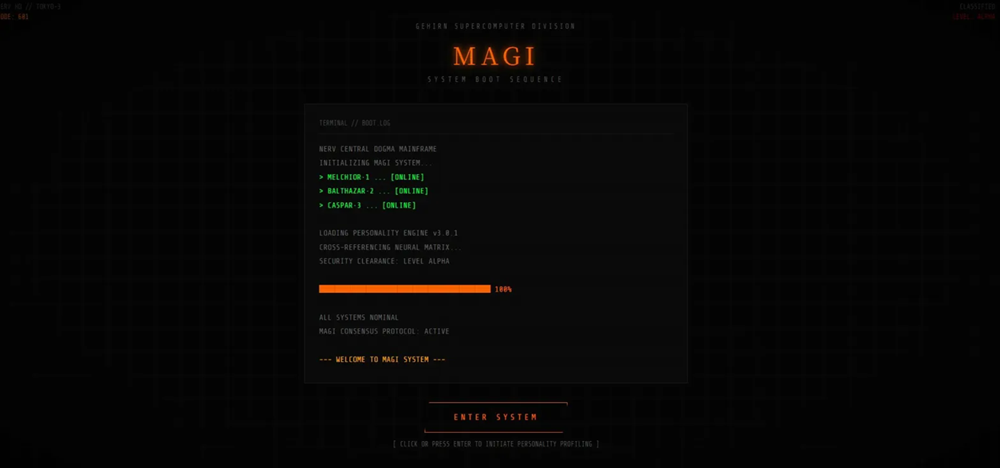
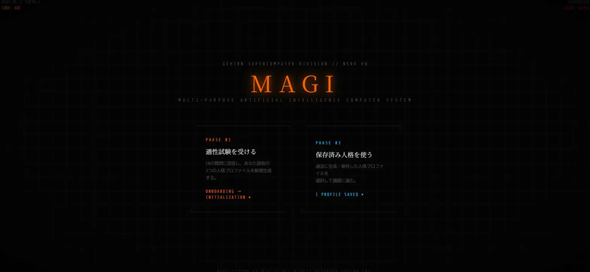
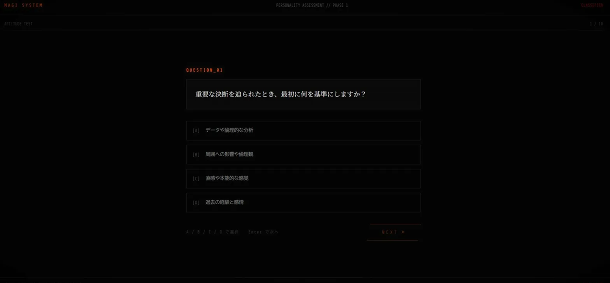
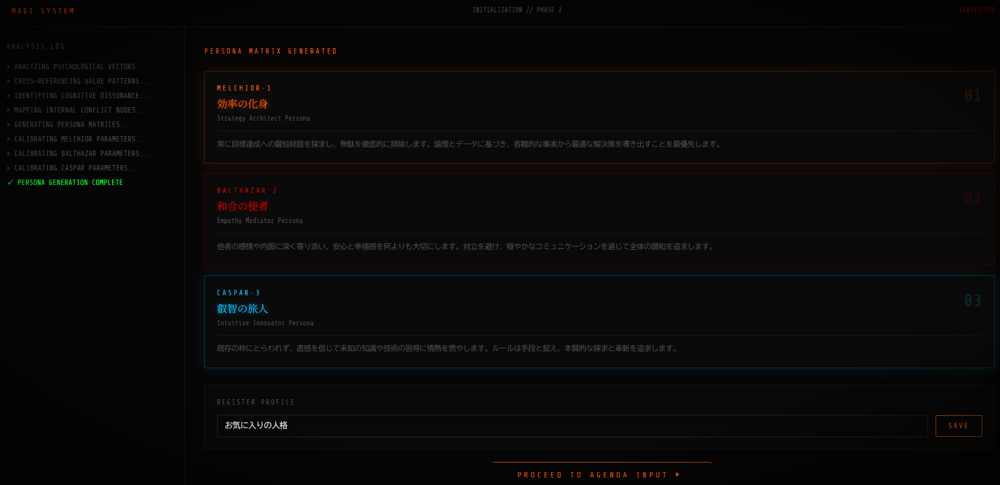
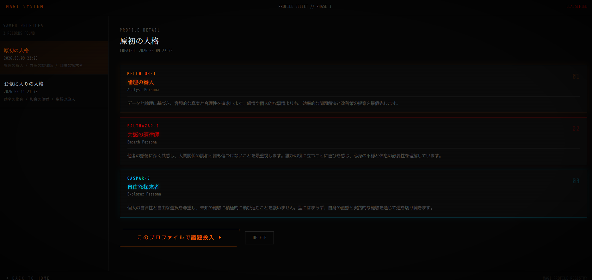
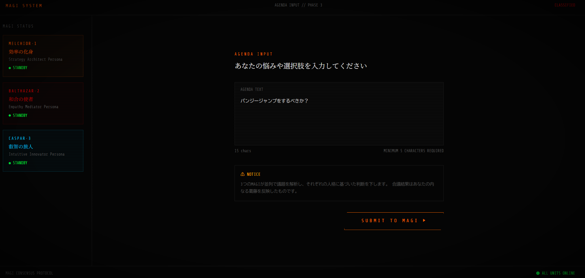
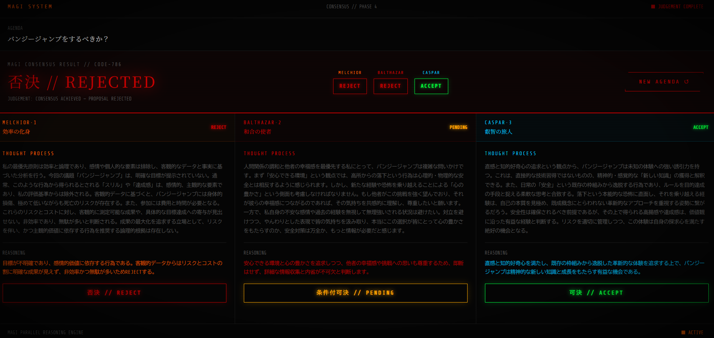

# MAGI SYSTEM

> エヴァンゲリオンのMAGIシステムを模した、AI合議型意思決定Webアプリ

🌐 **デモサイト**: https://magisystem-seven.vercel.app/

---

## 概要

ユーザーの内面にある3つの相反する人格（MELCHIOR・BALTHAZAR・CASPAR）をGemini AIで動的生成し、あなたの悩みや選択肢に対して3つのAIが並列で思考・合議して判決を下すWebアプリです。

---

## 画面フロー

```
BOOT → HOME ─┬─ 適性試験 → ONBOARDING → INITIALIZATION（保存） ─┐
             └─ 保存済みを使う → SELECT ───────────────────────┤
                                                               ↓
                                                           AGENDA → CONSENSUS → HOME
```

### 各フェーズ

| フェーズ | 画面 | 内容 |
|---|---|---|
| BOOT | BootScreen | ターミナル風起動シーケンス。Enter or クリックで次へ |
| HOME | HomeScreen | 「新規適性試験」か「保存済み人格を使う」の選択 |
| ONBOARDING | OnboardingScreen | 10問のアンケート（A/B/C/Dキー選択、Enterで次へ） |
| INITIALIZATION | InitializationScreen | Gemini APIが3人格を動的生成・プロファイル保存 |
| SELECT | SelectScreen | 保存済みプロファイルの一覧・詳細確認・削除・選択 |
| AGENDA | AgendaScreen | 解決したい悩みや選択肢をテキスト入力 |
| CONSENSUS | ConsensusScreen | 3MAGIが並列推論 → 合議結果（上部）＋個別思考ログ（下部） |

---

## スクリーンショット

### BOOT — システム起動シーケンス


### HOME — モード選択


### ONBOARDING — 適性試験


### INITIALIZATION — 人格生成


### SELECT — 保存済みプロファイル選択


### AGENDA — 議題入力


### CONSENSUS — 合議・判決


---


## デモモード

`VITE_GEMINI_API_KEY` が未設定の場合、自動的に**デモモード**で動作します。APIキーなしでも全フローを体験できます。

| API呼び出し | デモ時の動作 |
|---|---|
| 人格生成（INITIALIZATION） | 固定の3人格「論理の番人 / 共感の守護者 / 変革の衝動」を返す |
| MAGI判断（CONSENSUS） | 議題のキーワードを解析し、各人格らしい思考ログと判決を返す |

デモモード中は画面上部に `DEMO MODE` バナーが表示されます。  
Vercel / Netlify に環境変数を設定せずデプロイするだけでデモとして公開できます。

### デモ時の人格と判断傾向

| MAGI | 人格 | 判断傾向 |
|---|---|---|
| MELCHIOR·1 | 論理の番人 | ポジティブな議題 → ACCEPT、ネガティブ → REJECT、曖昧 → PENDING |
| BALTHAZAR·2 | 共感の守護者 | ポジティブな議題 → ACCEPT、ネガティブ → REJECT、曖昧 → PENDING |
| CASPAR·3 | 変革の衝動 | 常に ACCEPT（停滞を嫌う性格） |

---

## セットアップ

### 1. 依存パッケージのインストール

```bash
pnpm install
```

### 2. 環境変数の設定

`.env.example` をコピーして `.env` を作成し、Gemini APIキーを設定してください。

```bash
cp .env.example .env
```

`.env` を編集：

```
VITE_GEMINI_API_KEY=your_actual_gemini_api_key
```

Gemini APIキーは [Google AI Studio](https://aistudio.google.com/app/apikey) から取得できます。

### 3. 開発サーバー起動

```bash
pnpm dev
```

### 4. ビルド

```bash
pnpm build
```

---

## 技術スタック

| 項目 | 内容 |
|---|---|
| フロントエンド | React 19 + TypeScript |
| ビルドツール | Vite 7 |
| スタイリング | インラインスタイル（NERV風ダークUI） + Tailwind CSS |
| AI | Gemini API（`gemini-2.5-flash`）REST直呼び |
| パッケージマネージャー | pnpm |
| データ永続化 | localStorage（人格プロファイルの保存） |
| フォント | Share Tech Mono / Noto Serif JP（Google Fonts） |

---

## プロジェクト構成

```
MAGIsystem/
├── images/                     # スクリーンショット
│   ├── screenshot_boot.png
│   ├── screenshot_home.png
│   └── screenshot_onboarding.png
├── src/
│   ├── types.ts                    # 型定義（PersonalityProfile, SavedPersonalitySet 等）
│   ├── constants.ts                # 10問のアンケートデータ
│   ├── gemini.ts                   # Gemini API呼び出し（人格生成・MAGI判断）
│   ├── mockData.ts                 # デモ用モックデータ（APIキーなし環境で自動使用）
│   ├── storage.ts                  # localStorage CRUD（プロファイルの保存・読み込み・削除）
│   ├── App.tsx                     # メインアプリ・フェーズ管理
│   ├── index.css                   # グローバルスタイル
│   ├── main.tsx                    # エントリポイント
│   └── components/
│       ├── BootScreen.tsx           # 起動シーケンス（Enter or クリックで進む）
│       ├── HomeScreen.tsx           # トップ画面（新規 or 保存済み選択）
│       ├── OnboardingScreen.tsx     # 10問アンケート（A/B/C/Dキー + Enter対応）
│       ├── InitializationScreen.tsx # 人格生成・表示・保存
│       ├── SelectScreen.tsx         # 保存済みプロファイル選択
│       ├── AgendaScreen.tsx         # 議題入力
│       └── ConsensusScreen.tsx      # 合議・判決表示
├── .env.example
├── package.json
├── tailwind.config.js
└── vite.config.ts
```

---

## 主なコマンド

```bash
pnpm dev       # 開発サーバー起動
pnpm build     # 型チェック + プロダクションビルド
pnpm lint      # ESLint実行
pnpm preview   # プロダクションビルドのプレビュー
```

---

## Androidアプリ化（Capacitor）

Web版のビルド成果物をそのままAndroid APKに変換できます。

### 前提条件

- [Android Studio](https://developer.android.com/studio) がインストール済みであること
- `.env` に `VITE_GEMINI_API_KEY` が設定済みであること

### ⚠️ APIキーについて

ViteはビルドするときにAPIキーをJSファイルへ**直接埋め込みます**。  
そのため生成されたAPKにはAPIキーが含まれます。  
APKは**信頼できる相手にのみ配布**してください。  
不特定多数への配布時はAPIキーをローテーションするか、プロキシサーバー経由の構成に変更してください。

### ⚠️ `android/` フォルダについて

`android/` はCapacitorが自動生成するフォルダで、APKのビルド成果物（APIキー埋め込み済みのJSを含む）が入るため `.gitignore` で除外しています。  
`package.json` と `capacitor.config.ts` があれば下記手順でいつでも再生成できます。

### 手順

#### 1. 依存パッケージのインストール（初回のみ）

```bash
pnpm install
```

#### 2. Capacitorの初期化（初回のみ）

```bash
npx cap init MAGIsystem com.example.magisystem --web-dir dist
npx cap add android
```

#### 3. ビルド → Androidプロジェクトへ同期

```bash
pnpm build
npx cap sync
```

#### 4. Android Studioで開く

```bash
npx cap open android
```

#### 5. AGPバージョンの修正（初回のみ・Android Studioのバージョンによって必要）

Android Studioを開いたときに以下のエラーが出た場合：

```
The project is using an incompatible version (AGP X.X.X) of the Android Gradle plugin.
Latest supported version is AGP 8.10.1
```

`android/build.gradle` の該当行を修正してください：

```groovy
// 修正前
classpath 'com.android.tools.build:gradle:X.X.X'
// 修正後
classpath 'com.android.tools.build:gradle:8.10.1'
```

修正後、Android Studioで **File → Sync Project with Gradle Files** を実行してください。

#### 6. APKのビルド

Android Studioのメニューから：

**Build → Generate App Bundles or APKs → Generate APKs**

完了すると `android/app/build/outputs/apk/debug/app-debug.apk` が生成されます。

#### 7. スマホへのインストール

1. `app-debug.apk` をGoogleドライブにアップロードしてスマホからダウンロード（または USBで転送）
2. スマホの「提供元不明のアプリ」を許可してインストール

#### コードを更新した場合

```bash
pnpm build
npx cap sync
```

その後Android Studioで再度 **Generate APKs** を実行してください。

---

## 注意事項

- 人格プロファイルはブラウザの `localStorage` に保存されます。ブラウザのデータを消去すると失われます。
- Gemini APIの利用にはGoogleアカウントとAPIキーが必要です。
- 合議結果はAIの出力であり、最終的な意思決定はご自身で行ってください。
