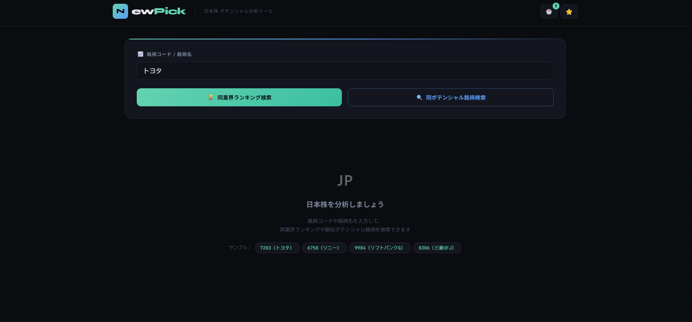
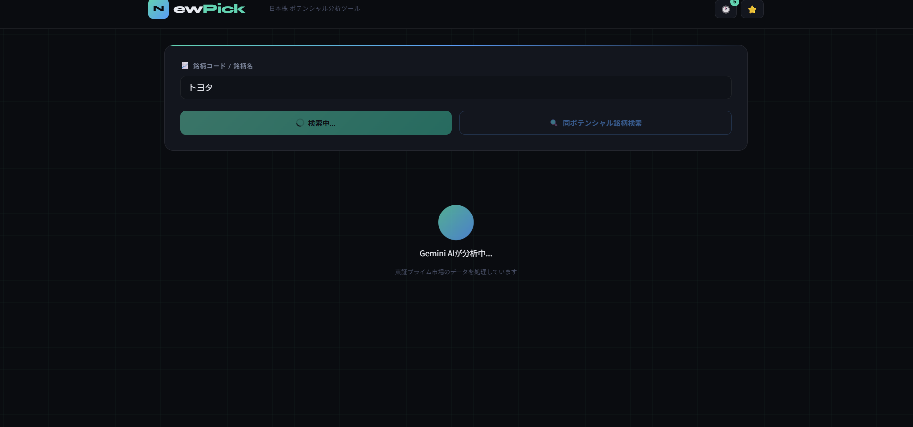
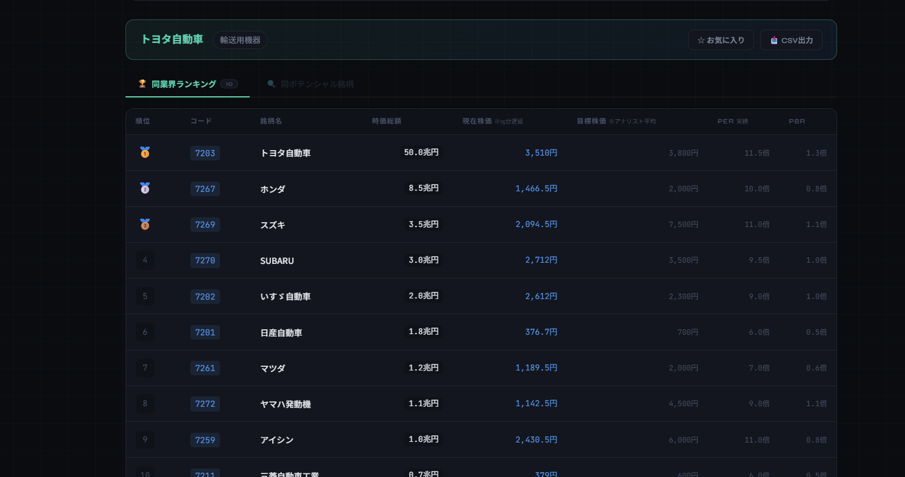
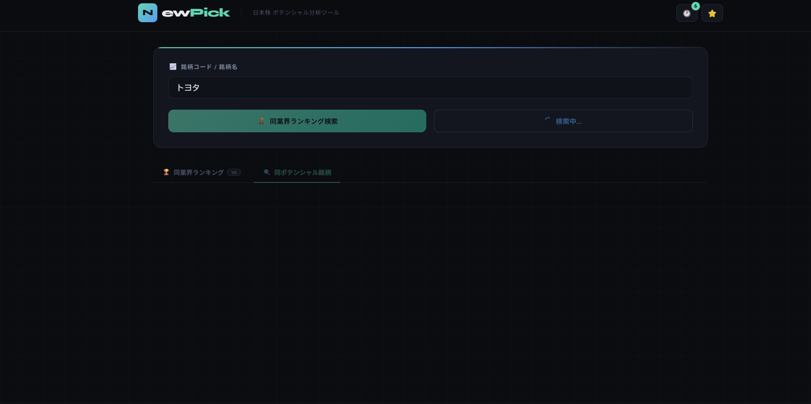
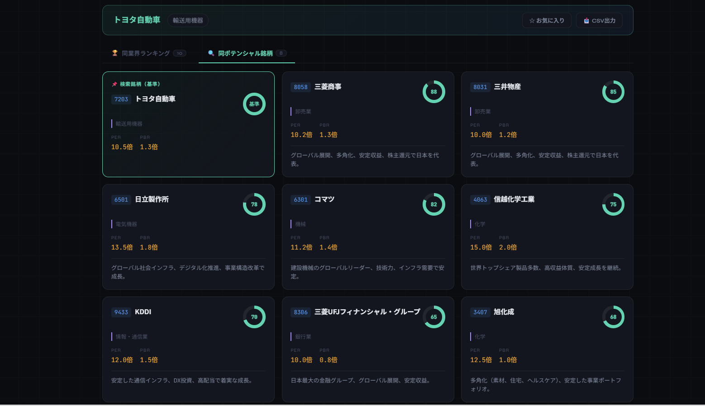

# NewPick 🇯🇵

**日本株 ポテンシャル分析ツール**

銘柄コードまたは銘柄名を入力するだけで、同業界ランキングや類似ポテンシャル銘柄を AI が分析・提示するWebアプリです。

---

## スクリーンショット

### 入力フォーム


### 同業界ランキング — 分析中


### 同業界ランキング — 結果


### 同ポテンシャル銘柄 — 分析中


### 同ポテンシャル銘柄 — 結果


---

## 機能

- **同業界ランキング検索** — 入力銘柄と同じ業界の銘柄を時価総額・PER・PBR・AI推定目標株価付きで一覧表示
- **同ポテンシャル銘柄検索** — 財務指標や事業特性が似た銘柄を類似度スコア付きでカード表示
- **リアルタイム株価取得** — Yahoo Finance 経由で現在株価を15分遅延で取得（Express サーバー）
- **検索履歴・お気に入り** — ブラウザの localStorage に保存。サイドパネルから再検索可能
- **CSV エクスポート** — ランキング・類似銘柄・お気に入りリストをCSVでダウンロード

---

## 技術スタック

| レイヤー | 使用技術 |
|---|---|
| フロントエンド | React 19 + TypeScript + Vite |
| AI 分析 | Google Gemini API (`gemini-2.5-flash`) |
| 株価取得 | Express + yahoo-finance2 |
| スタイリング | CSS Modules (カスタム) |

---

## デモモード

`VITE_GEMINI_API_KEY` が未設定の場合、自動的に**デモモード**で動作します。APIキーなし・株価サーバーなしでも全機能を体験できます。

| 機能 | デモ時の動作 |
|---|---|
| 同業界ランキング | トヨタ・ソニー・ソフトバンクG・三菱UFJの4銘柄は詳細データを返す。それ以外は汎用データを返す |
| 同ポテンシャル銘柄 | 同上 |
| 現在株価 | 登録済み銘柄はモック株価を表示。未登録銘柄はticker番号から自動生成した株価を表示 |

デモモード中は画面ヘッダーに `DEMO MODE` バッジが表示されます。  
Vercel / Netlify に環境変数を設定せずデプロイするだけでデモとして公開できます。

### デモで試せるサンプル銘柄

| 入力 | 内容 |
|---|---|
| `7203` | トヨタ自動車（自動車業界ランキング） |
| `6758` | ソニーグループ（電気機器業界ランキング） |
| `9984` | ソフトバンクグループ（通信業界ランキング） |
| `8306` | 三菱UFJフィナンシャル・グループ（銀行業界ランキング） |

---

## セットアップ

### 前提条件

- Node.js 18+
- pnpm（または npm / yarn）
- [Google AI Studio](https://aistudio.google.com/app/apikey) で取得した Gemini API キー

### インストール

```bash
# フロントエンド依存関係
pnpm install

# サーバー依存関係
cd server && npm install && cd ..
```

### 環境変数の設定

`.env.example` をコピーして `.env` を作成し、APIキーを設定してください。

```bash
cp .env.example .env
```

```env
VITE_GEMINI_API_KEY=your_gemini_api_key_here
```

> `.env` は `.gitignore` に含まれているため、Git にコミットされません。

### 起動

> ⚠️ **株価を表示するには、フロントエンドより先にサーバーを起動する必要があります。**  
> サーバーが起動していない状態で検索すると、現在株価・目標株価・PER・PBRの欄が「取得失敗」と表示されます。

**ターミナル1（先に起動）: 株価取得サーバー（ポート 3001）**
```bash
cd server
node index.js
# "✅ NewPick サーバー起動: http://localhost:3001" と表示されたらOK
```

**ターミナル2: フロントエンド開発サーバー（ポート 5173）**
```bash
pnpm dev
```

ブラウザで `http://localhost:5173` を開いてください。

### ビルド

```bash
pnpm build
```

---

## 使い方

1. **銘柄コード / 銘柄名** 欄に検索したい銘柄を入力（例: `7203` / `トヨタ自動車`）
2. **同業界ランキング検索** または **同ポテンシャル銘柄検索** ボタンをクリック
3. 結果は ⭐ でお気に入り登録、📥 で CSV 出力が可能

---

## ディレクトリ構成

```
NewPick/
├── src/
│   ├── App.tsx          # メインコンポーネント・UI全体
│   ├── gemini.ts        # Gemini API 呼び出しロジック
│   ├── mockData.ts      # デモ用モックデータ（APIキーなし環境で自動使用）
│   ├── stockPrice.ts    # 株価取得（サーバー経由）
│   ├── storage.ts       # 履歴・お気に入りの永続化（localStorage）
│   └── export.ts        # CSV エクスポート処理
├── server/
│   └── index.js         # Express サーバー（Yahoo Finance プロキシ）
└── index.html
```

---

## バイブコーディング環境

本プロジェクトは **Claude Desktop + Serena MCP** を使ったバイブコーディングで開発されました。

### 使用ツール

| ツール | 役割 |
|---|---|
| [Claude Desktop](https://claude.ai/download) | AIコーディングアシスタント（チャットUI） |
| [Serena](https://github.com/oraios/serena) | Claude用MCPサーバー。ファイル読み書き・シンボル検索・プロジェクト記憶などコードベース操作を提供 |

### 環境構築手順

#### 1. Claude Desktop のインストール

[claude.ai/download](https://claude.ai/download) からインストールします。

#### 2. Serena のセットアップ

```bash
# uv（Pythonパッケージマネージャ）が必要
# インストールされていない場合:
# https://docs.astral.sh/uv/getting-started/installation/

# Serena をクローン
git clone https://github.com/oraios/serena
cd serena
```

#### 3. Claude Desktop に Serena を登録

Claude Desktop の設定ファイル（`claude_desktop_config.json`）に以下を追加します。

**設定ファイルの場所:**
- Windows: `%APPDATA%\Claude\claude_desktop_config.json`
- macOS: `~/Library/Application Support/Claude/claude_desktop_config.json`

```json
{
  "mcpServers": {
    "serena": {
      "command": "uvx",
      "args": [
        "--from", "git+https://github.com/oraios/serena",
        "serena-mcp-server",
        "--context", "desktop-app",
        "--project-directory", "C:/Users/yourname/app-dev"
      ]
    }
  }
}
```

> `--project-directory` は自分のプロジェクトフォルダに合わせて変更してください。

#### 4. プロジェクトをSerenaに登録

Claude Desktop を再起動後、チャットで以下のように話しかけるとプロジェクトが認識されます：

```
serenaを使って C:\Users\yourname\app-dev\NewPick を開いて
```

#### 5. 開発の始め方

あとは Claude に自然言語で指示するだけです。

```
# 例
「src/App.tsx のAPIキー入力UIを削除して環境変数から読み込むように変更して」
「READMEを実際のプロジェクト内容に合わせて更新して」
```

---

## 注意事項

> 本ツールの分析結果はAIによる推定であり、投資判断の参考情報です。  
> 実際の投資判断はご自身の責任でお願いします。株価データは15分程度の遅延があります。
